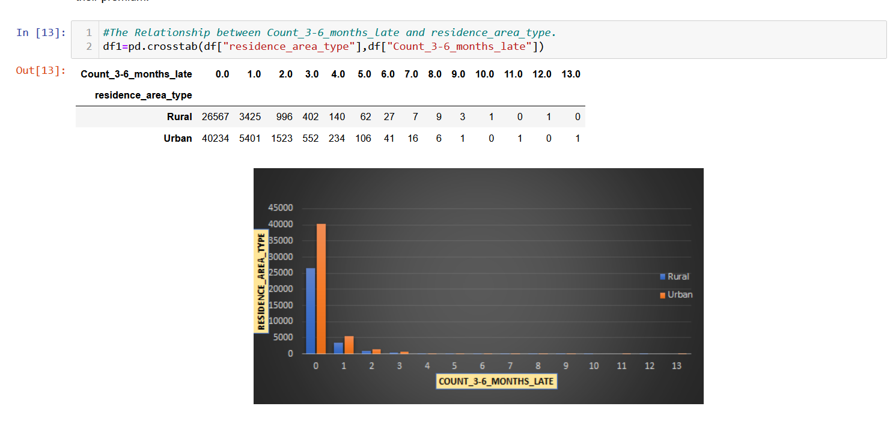

# Project topic: Laps are not laps policy prediction.

  The object of this project to develop a predictive model that accurately forecasting the likelihood of insurance policyholders lapsing their coverage within next 12 months.
At the heart of this project was to recognition of the critical issues facing by the client , particularly prominent in entity. This is challenge revolves around the predicting the laps policies a scenario in which the policyholder choose not to renew their insurance policy, such as laps can be  lead to financial state backs for the both policyholder and client.
Our team set a fourth commission to develop the rubbish machine learning model. Capable of the accurately forecasting whether the policyholder would be continue their insurance coverage, or let it lapse. The primary motivation was to Collaborate with the insurance company. And Foresight to protectively address potential policy labs by taking the preventive measures. This company could ensure that the stability. Of the policyholder and financial future while simultaneously fortifying their own financial standing.

